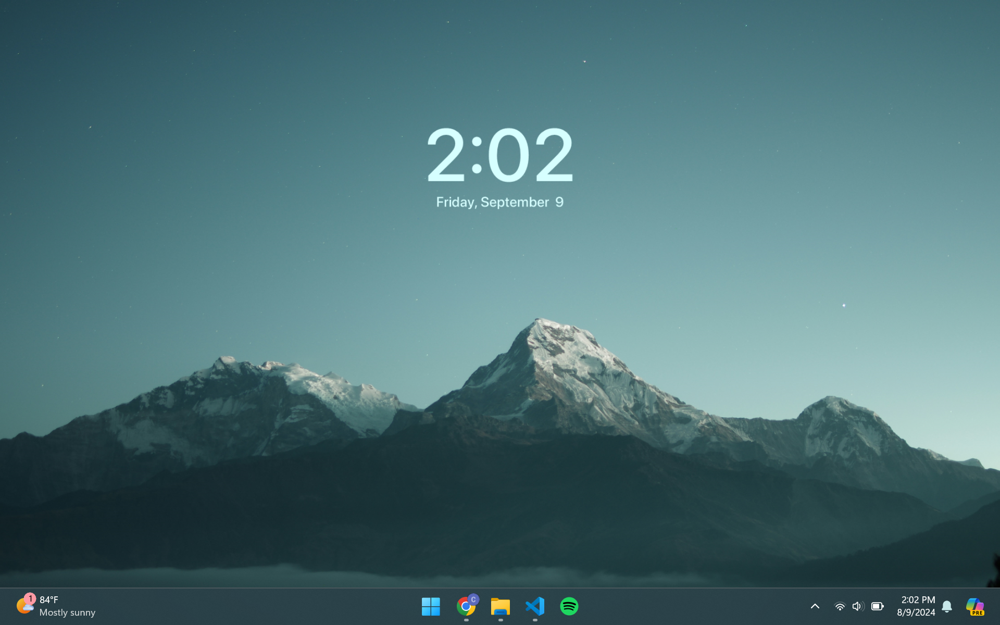

# Daily Wallpaper (Mini)

Ultra-lightweight wallpaper engine that runs in the background (for Windows)



## Features

- Refreshes your wallpaper with a new image from Unsplash each day
- Configure the wallpaper search term (ex. nature, flowers, outer space, New York)
- Save and load your favorite wallpapers
- Toggle the time and date overlay
- Adjust wallpaper refresh time from every 10 mins to never refresh
- Ultra-lightweight: runs in the background and uses virtually no resources

## Download

Go to <a href="https://github.com/underpig1/Daily-Wallpaper-Mini/releases">Releases</a> and download the latest version of `daily_wallpaper.exe`

Note: it sometimes gets flagged by anti-virus software on my device, but I'll work on fixing that in the future.

## Use

Run the executable `daily_wallpaper.exe` for the first time. The applet will appear in the system tray. Click on the Daily Wallpaper icon to open the menu, which will allow you to customize the applet's behavior, save and load wallpapers, and toggle the overlay.

### Install
The applet will automatically install when you run `daily_wallpaper.exe` for the first time. This will schedule a task to run the applet on startup and login in the background.

Or, run the executable with the `-install` flag:
```
daily_wallpaper.exe -install
```

### Uninstall
Run the executable with the `-uninstall` flag:
```
daily_wallpaper.exe -uninstall
```

## Build

1. Create a new file in the root directory and name it `secrets.env`, and include your Unsplash API key:
```
UNSPLASH_ID="YOUR_API_KEY_HERE"
```

2. Run `build.ps1` in powershell with administrator privileges

3. Run `dist/daily_wallpaper.exe`

## See also

If you're looking for a free wallpaper engine with a lot more features, consider checking out my other project - [Octos](https://github.com/underpig1/octos): HTML Live Wallpaper Engine.